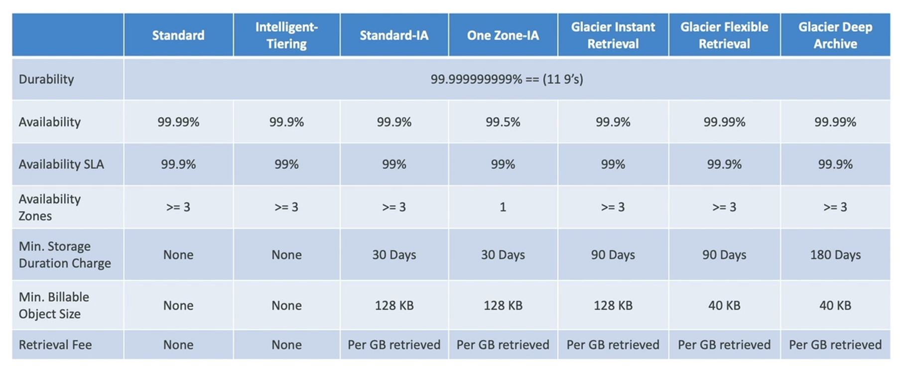
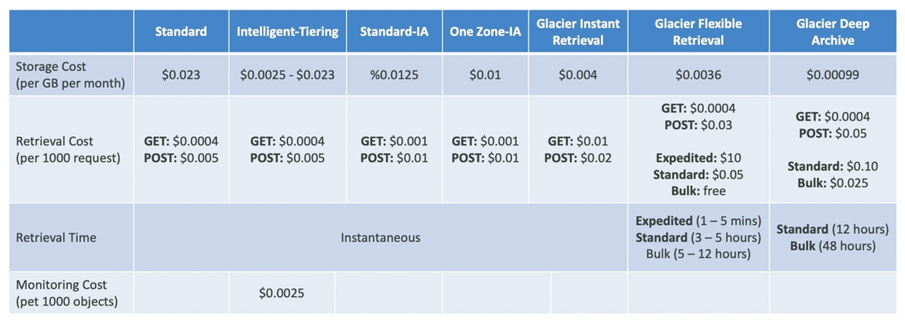

# S3 Storage Classes

There are different storage classes for S3:
- S3 Standard General Purpose
- S3 Standard Infrequent Access (IA)
- S3 One Zone Infrequent Access (IA)
- S3 Glacier Instant Retrieval
- S3 Glacier Flexible Retrieval
- S3 Glacier Deep Archive
- S3 Intelligent Tiering

When you create an object in S3:
- you can choose its class
- you can modify its storage class manually
- you can use **S3 lifecycle configurations** to move objects automatically between storage classes

## Durability and Availability

- **Durability**
    - it represents how many times an object is going to be lost by S3
    - **same for all storage classes**
    - high durability (99.999999999, eleven 9's) of objects across multiple AZ
    - if you store 10M objects on S3, you can expect to lose a single object once every 10K years

- **Availability**
    - it represents how readily a service is
    - **it depends on the storage class**
    - example:
        - S3 standard has a 99.99% availability (i.e. not available 53 minutes a year)

## Storage Classes

- **S3 Standard General Purpose**
    - 99.99% availability
    - used for frequently accessed data
    - low latency and high throughput
    - sustain 2 concurrent facility failures
    - uses cases:
        - big data analytics
        - mobile and gaming applications
        - content distribution
- **S3 Infrequent Access**
    - data that is less frequently accessed, but requires rapid access when needed
    - **lower costs than S3 Standard but you will have a cost on retrieval**
    - two sub-classes:
        - **S3 Standard - Infrequent Access (S3 Standard IA)**
            - 99.99% availability
            - use cases: disaster recovery, backups
        - **S3 One Zone - Infrequent Access (S3 One Zone IA)**
            - 99.999999999% availability in a sigle AZ (data lost when AZ is destroyed)
            - 99.5% availability
            - use cases: storing secondary backup copies of premises data or data you can recreate
- **S3 Glacier**
    - low cost object storage meant for archiving/backup
    - **pricing: pay for storage + pay for retrieval**
    - three sub-classes:
        - **S3 Glacier Instant Retrieval**
            - millisecond retrieval, great for data accessed once a quarter
            - minimum storage duration is 90 days
        - **S3 Glacier Flexibile Retrieval**
            - 3 flexibility data back:
                - expedited (1 to 5 minutes)
                - standard (between 3 to 5 hours)
                - bulk (between 5 to 12 hours)
            - minimum storage duration is 90 days
        - **S3 Glacier Deep Archive**
            - long term storage
            -lower costs
            - 2 tiers:
                - standard (12 hours)
                - bulk (48 hours)
            - minimum storage duration is 180 days
- **S3 Intellingent Tiering**
    - small monthly monitoring and auto-tiering fee
    - moved objects automatically between access tiers based on usage 
    - there are no retrieval charges in S3 intelligent tiering
    - different tiers:
        - *frequent access tier (automatic)*: default tier
        - *infrequent access tier (automatic)*: objects not accessed for 30 days
        - *archive instant access tier (automatic)*: objects not accessed for 90 days
        - *archive access tier (optional)*: configurable from 90 days to 700+ days
        - *deep archive access tier (optional)*: configurable from 180 days to 700+ days

## Storage Class Comparison

## Storage Class Price Comparison

