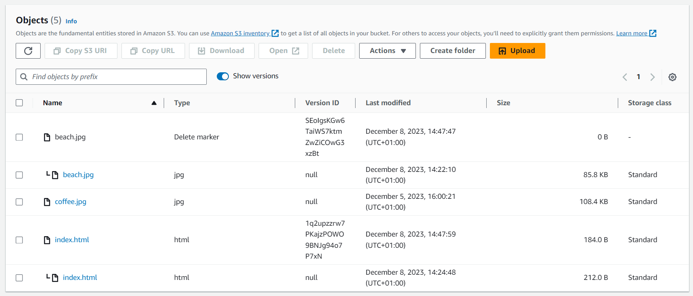

# S3 Versioning

S3 can be used to **version files**. 

S3 versioning is a property enabled at **bucket level**.

A file upload with **the same key create a new version**.

Why versioning files ?

- it protects against unintended deletes (ability to restore a version)
- it is easy to rollback to previous version

Notes:

- any file that is not versioned prior to enabling versioning will have version *null*
- suspend versioning does not delete the previous versions (it's a *safe operation*)

