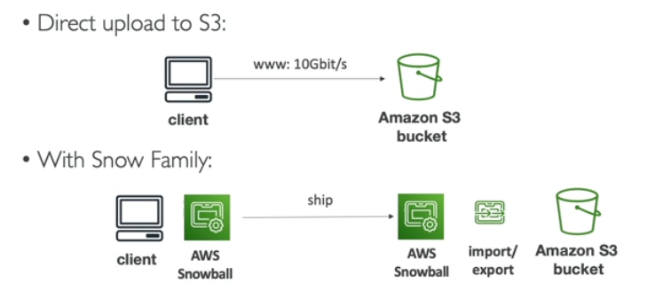
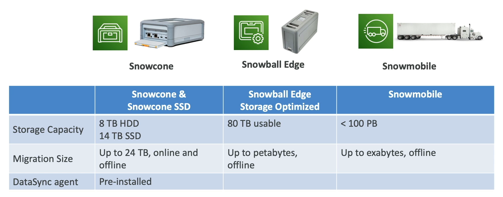

# AWS Snow Family

AWS Snow Family represents a highly secure portable devices that has two use cases within AWS:
- Collect and process data at the edge
    - Snowcone
    - Snowball Edge 
- Migrate data in and out of AWS
    - Snowcone
    - Snowball Edge (petabyte scale)
    - Snowmobile (exabyte scale)

## Data Migration

AWS Snow Family are **offline devices** to perform data migrations.

It is a way to transfer data to AWS but through the *physical route* not the *network route*.

**NOTE.** If it takes more than a week to transfer over the network use AWS Snowball devices.

Challenges:
- limited connectivity
- limited or shared bandwith
- high network cost
- connection stability

Devices:
- Snowball Edge
    - Snowball Edge Storage Optimized (80 TB)
    - Snowball Edge Compute Optimized (42 TB)
- Snowcone
    - small, portable computing, anywhere, rugged & secure
    - **use it when showball does not fit (space-constrained capacity)**
    - Snowcone (Base) (8TB)
    - Snowcone SSD (16 TB)
    - data can be sent back to AWS:
        - offline
        - connect to internet and use AWS DataSync
- Snowmobile
    - it is an actual truck!
    - it can transfer Exabytes of Data (1 EB = 1K PT = 1M TB)
    - each truck has 100 PB of capacity (use multiple in parallel)
    - high secure: temperature controlled, GPS, 24/7 surveillance
    - better than showball if you transfer more than 10 PB

## Usage Process

1. Request Snowball devices from the AWS console for delivery
2. Install the Snowball Client or AWS OpsHub on your servers
3. Connect the Snowball to your servers and copy files using the client
4. Ship back to the device when you are done (to AWS Facility)
5. Data will be loaded into a S3 Bucket
6. Snowball is completely wiped

## Edge Computing

Edge Computing is when you process data while it's being created at an edge location. 

An edge location is anything that really doesn't have internet or that is far away from a cloud.

An edge location may have:
- limited / no internet access
- limited / no easy access to computing power

Use Cases (long-term deployment: 1-3 years):
- pre-process data
- machine learning at the edge
- trascoding media stream

Devices (all run EC2 instances or AWS Lambda functions):
- Snowcone and Snowcone SSD (smaller)
- Snowball Edge - Computing Optimized
- Snowball Edge - Storage Optimized

## AWS OpsHub

AWS OpsHub is a software that you install on your computer or laptop. Once it's connected, it's going to give you a graphical interface to connect to your Snow devices, and configure them and use them.

## AWS Snowball Edge Pricing

You pay for:
- **device usage**
    - on-demand (include one-time service fee per job)
    - committed  upfront (pay in advance, discounted pricing)
- **data transfer out** of AWS

**NOTE.** If you put data onto your Snowball Edge and then put that data onto Amazon S3 it's going to be **free**.

