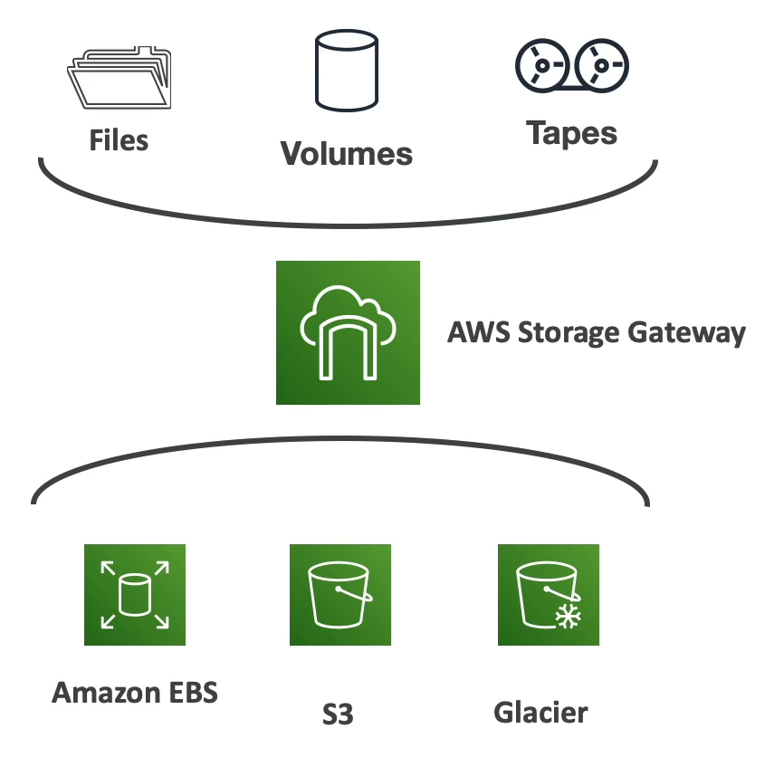

# Storage Gateway

S3 is a proprietary storage technology. It is not something like the EFS service or NFS protocol that we can use directly on two servers on-premises.

For **exposing S3 data on-premises**, you have to use something called a **Storage Gateway**.

Storage Gateway allows you to bridge whatever happens on-premises directly into the AWS Cloud. The Storage Gateway will be using Amazon EBS, Amazon S3, and Glacier behind the scenes.

Types of Storage Gateway:
- File Gateway
- Volume Gateway
- Tape Gateway

Use cases:
- Disaster recovery
- Backup and restore
- Tiered storage

