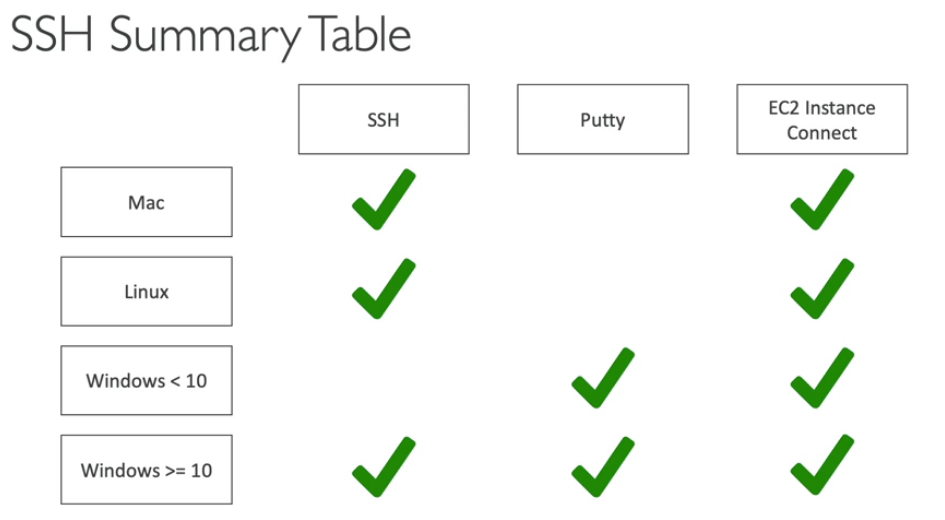

# Secure Shell

## How to connect

    > cd <where_the_key_pair_is_located>
    > chmod 0400 <my_key_pair.pem>
    > ssh -i <my_key_pair.pem> ec2-user@<public_ip_address>
    > whoami

**ec2-user** is already setup for any Amazon Machine Image (AMI)
