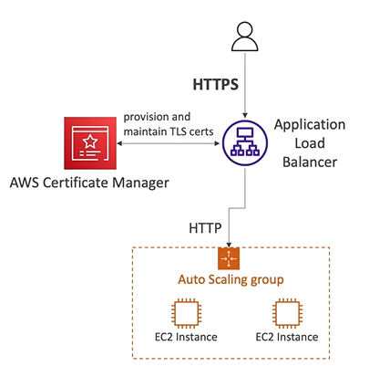

# AWS Certificate Manager

- **AWS Certificate Manager (ACM)** is a service to easily provision, manage and deploy **SSL/TLS certificats**
- Certificates are used to provide in-flight encryption for websites (HTTPS)
- Supports both public and private TLS certificates
- Free of charge for public TLS certificates
- Automatic TLS certificate renewal
- Integrations with (i.e. load certificates on)
    - Elastic Load Balancer
    - CloudFront distribution
    - APIs on API Gateway

