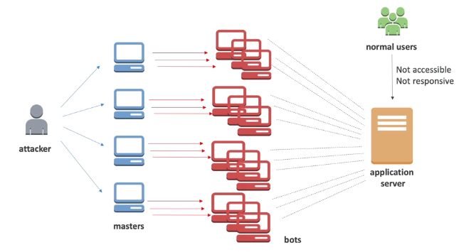
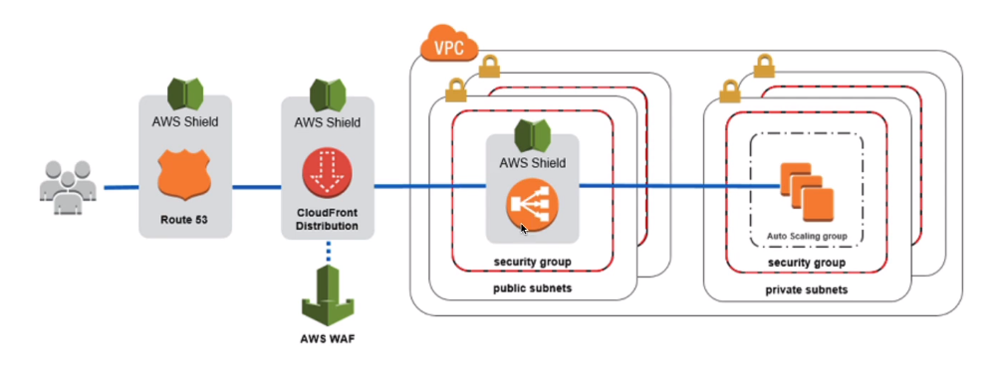

# DDoS Protection: WAF & Shield

A DDoS attack is a Distributed Denial-of-Service attack.

## DDoS Protection on AWS

- **AWS Shield Standard**
    - protects againts DDoS attack for your website and applications
    - **for all customers at no additional costs**
- **AWS Shield Advanced**
    - 24/7 premium DDoS protection
- **AWS Web Application Firewall (WAF)**
    - filter specific requests based on rules
- **CloudFront and Route 53**
    - availability protection using global edge network
    - combined with AWS Shield, provides attack mitigation at the edge

**NOTE**. Be ready to scale: leverage **AWS Auto Scaling**.

## Sample Reference Architecture for DDoS Protection

## AWS Shield

- **AWS Shield Standard**
    - Free service that is activated for every AWS customer
    - Provides protection from attacks such as SYN/UDP Floods, Reflection attacks and other layer 3/4 attacks
- **AWS Shield Advanced**
    - Optional DDoS mitigation service ($3000 per month per organization)
    - Protection against more sophisticated attack on:
        - EC2
        - ELB
        - CloudFront
        - Global Accelerator
        - Route 53
    - 24/7 access to AWS DDoS response team (DRP)
    - **Protect agains higher fees during usage spikes due to DDoS**

## AWS Web Application Firewall (WAF)

- Protects your web applications from common web exploits (Layer 7)
- Can be deployed on Application Load Balancer, API Gateway, CloudFront
- You can define Web ACL (Web Access Control List)
    - Rules can include IP addresses, HTTP headers, HTTP body or URI strings
    - Protects from common attack: SQL injection and Cross-Site Scripting (XSS)
    - Size constraints, geo-match (block countries)
    - Rate-based rules (to count occurrences of events)