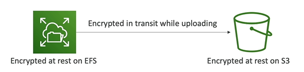
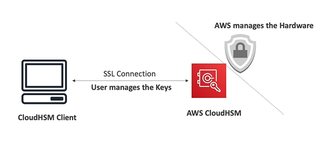

# Encryption with KMS

There are two type of data encryption on AWS:
- Encryption **at rest** (data stored or archived on a device)
    - E.g. encrypted at rest on EFS or S3
- Encryption **in transit** (data moved from one location to another)
    - E.g. from on-premises to AWS or from EC2 to DynamoDB
    - Means data transferred on the network

Types of KSM keys:
- **Customer Managed Key**
    - Created, managed and used by the customer
    - Can be enabled/disabled
    - Possibility of rotation policy (e.g. new key generated every year, old key preserved)
    - Possibility to bring your-own-key
    - **They costs you some money!**
- **AWS Managed Key**
    - Created, managed and used on the customer's behalf by AWS
    - Used by AWS Services (aws/s3, sws/ebs, aws/redshift, etc.)
- **AWS Owned Key**
    - Collection of CMKs that an AWS service owns and manages to use in multiple accounts
    - AWS can use those to protect resources in your account (but you can't view the keys)
- **Custom CloudHSM Keys** (custom keystore)
    - Keys generated from your own CloudHSM hardware device

## AWS Key Service Management (KSM)

- AWS KMS manages the **encryption keys** for us (and we define who can access the keys)
- **Encryption Opt-In**:
    - EBS volumes: encrypt volumes
    - S3 buckets: server-side encryption of objects
    - Redshift database: encryption of data
    - RDS database: encryption of data
    - EFS drives: encryption of data
- **Encryption Automatically Enabled**:
    - CloudTrail Logs
    - S3 Glacier
    - Storage Gateway

## Cloud HSM

- HSM = Hardware Security Module (Dedicated Hardware)
- CloudHSM AWS provides encryption hardware
- You manage your own encryption keys entirely (not AWS)
- HSM device is tamper resistance
- FIPS 140-2 Level 3 compliance (security standard)

