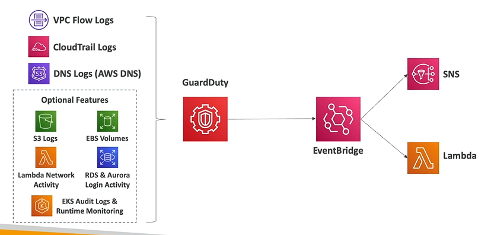

# AWS GaurdDuty

- AWS GuardDuty helps you do **intelligent threat discovery** to protect your AWS account
- It uses Machine Learning algorithms, anomaly detection, third part data
- One click to enable (30 days trial), no need to install software
- Input data includes:
    - **CloudTrail Events Logs** (unusual API calls, unauthorized deployments)
    - **VPC Flow Logs** (unusual internal traffic, unsual IP address)
    - **DNS Logs** (compromised EC2 instances sending encoded data within DNS queries)
    - **Optional Feature** (S3 Logs, EBS Volumes, etc.)
- Can setup **EventBridge rules** to be notified in case of findings
    - EventBrige can target AWS Lambda or SNS
- Can protect against CryptoCurrency attacks (has a deditcated "finding" for it)

