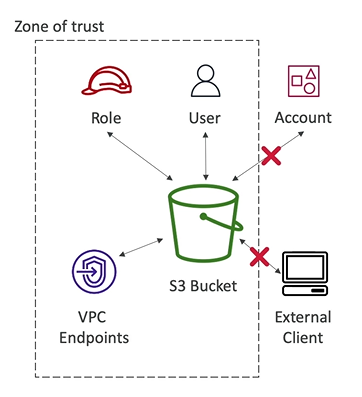

# IAM Access Analyzer

- IAM Access Analyzer is a service within the IAM console that is used to **find out which resources are shared externally** (e.g. other accounts)
    - S3 Buckets
    - IAM Roles
    - KMS Keys
    - Lambda Functions and Layers
    - SQS Queues
    - Secret Manager Secrets
- Define a **Zone of Trust** that corresponds to your alias AWS Account or alias AWS Organization
- Access outside zone of trusts are **findings**

