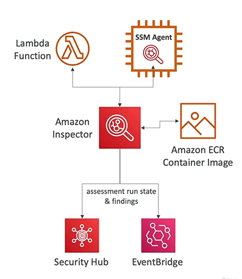

# AWS Inspector

- AWS Inspector is a service that allows you to run **automated security assessments** on a couple of things
    - **For EC2 instances**
        - Leveraging the AWS System Manager (SSM) agent
        - Analyze against unintended network accessibility
        - Analyze the running OS against known vulnerabilities
    - **For Container Images push to AWS ECR**
        - Assessment of container images as they are pushed
    - **For Lambda Functions**
        - Identifies software vulnerabilities in function code and package dependencies
        - Assessment of functions as they are deployed 
- Every time AWS Inspector runs, a **risk score** is going to be associated with all the vulnerabilities for prioritization
- Reporting and integration with AWS Security Hub
- Send findings to Amazon Event Bridge

