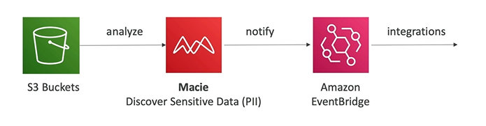

# AWS Macie

- AWS Macie is a fully managed data security and data privacy service that uses machine learning and pattern matching to discover and protect **your sensitive data**
- It helps identify and alert you to sensitive data, such as personally identifiable information (PII) or intellectual property

