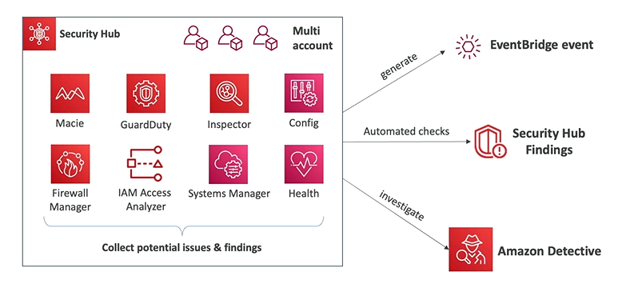

# AWS Security Hub

- AWS Security Hub is a **central security tool** to manage security **across several AWS accounts** and automate security checks
- Integrated dashboards showing current security and compliance status to quickly take actions
- Automatically aggregates alerts in predefined or personal findings format from various AWS services and AWS partner tools:
    - Config
    - GuardDuty
    - Inspector
    - Macie
    - IAM Access Analyzer
    - AWS System Manager
    - AWS Firewall Manager
    - AWS Health
    - AWS Partner Solutions
- Must first enable the AWS Config Service

