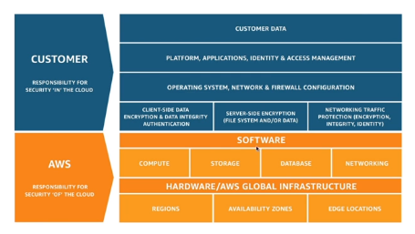

# AWS Shared Responsibility Model

- AWS responsibility - Security **of the cloud**
    - Protecting infrastructure (hardware, software, facilities, and networking) that runs all the AWS services
    - Managed services like S3, DynamoDB, RDS, etc.
- Customer responsibility - Security **in the cloud**
    - For EC2 instance: management of the guest OS (including security patches and updates), firewall & network configuration, IAM
    - Encrypting application data
- Shared Controls
    - Patch management, configuration management, awareness & training, etc.

## Example: S3

- AWS responsibility
    - Guarantee you get unlimited storage
    - Guarantee you get encryption
    - Ensure separation of the data between different customer
    - Ensure AWS employees can't access the data
- Customer responsibility
    - Bucket configuration
    - Bucket policy / public setting
    - IAM user and roles
    - Enabling encryption

## Example: RDS

- AWS responsibility
    - Manage the underlying EC2 instace, disable SSH access
    - Automated DB patching
    - Automated OS patching
    - Audit the underlying instance and disks & guarantee it functions
- Customer responsibility
    - Check the ports, IP, security group inbound rules in DB's SG
    - In-database user creation and permissions
    - Creating a database with or without public access
    - Ensure parameter groups or DB is configured to only allow SSL connections
    - Database encryption setting
